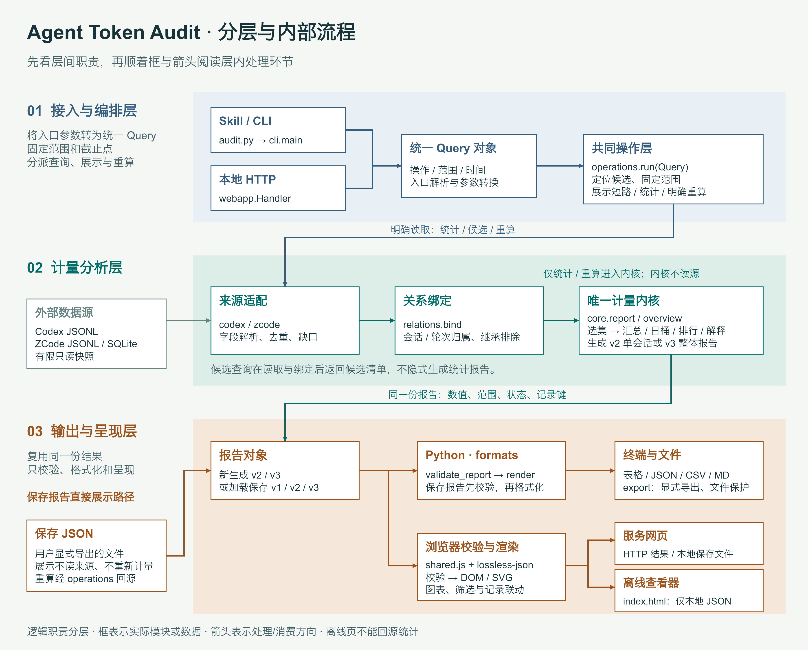

# 图设计：三层职责与层内流程

[查看原尺寸 PNG（3600 × 2900）](./architecture.png) · [可编辑 PPTD 图源](./architecture.pptd)

- 目标：同时看清“接入与编排层 → 计量分析层 → 输出与呈现层”及每层内部的处理顺序。层是源码职责分组，不表示独立部署服务。
- 结构：三层上下排列为泳道，层内从左到右阅读。实际模块和数据各用独立框，箭头连接汇合、顺序和分支；层间连线在泳道间留白中转向。外部数据源及保存文件在对应泳道左侧，避免与调用入口混淆。
- 方案比较：对照原横向三列图与上下泳道流程图。三列能强调职责，但展开接入汇合、计量链和输出分支后会挤压文字并需要绕行；泳道为层内流程留出横向空间，因此选择泳道。检查重点是不能再退化为大色块中的段落列表。
- 接入流程：Skill/CLI、HTTP 分别汇入 Query，再进入 operations.run，统一处理定位、范围、展示短路和统计/重算分派。
- 计量流程：外部只读数据 → codex/zcode 适配 → relations.bind 归属 → core.report/overview → v2/v3 报告。候选查询读取/绑定后返回清单，不进入统计内核；report/overview 不读源。
- 输出流程：同一份报告分为 Python 和浏览器两条消费路径。formats 校验保存报告、格式化及受保护显式导出；shared.js 与无损 JSON 校验并生成 DOM/SVG，服务页消费 HTTP 或保存文件，离线页仅消费本地 JSON。
- 保存路径：保存 JSON 直接进入输出层的报告加载/校验和呈现，绕过来源与计量内核；只有明确重算/更新才经 operations 读取允许来源。图中以说明标注重算，避免大回路穿过主流程。
- 视觉：1800 × 1450 画布、2 倍 PNG；蓝灰标接入与编排，青绿标计量分析，赭色标输出呈现。标题 44、层标题 32、节点标题 25–27、正文 21–24；无装饰图标或阴影。
- 字体与产物：图源和 PNG 均使用本机 Arial / Hiragino Sans GB（冬青黑体），所有文本、节点和线可编辑，无字体文件或外链。复用现有 PPTD、PNG 和本文路径。
- 导出限制：无 kimi-slides CLI，使用工作区外临时 Canvas 解释器按本图实际 PPTD 字段栅格化；无新增产品依赖，未进行官方渲染引擎或 PPTX 验证。

## Karpathy 精简与自检

- 基线：核对现有实现合同、architecture.md，以及 operations.read_input/run、formats.validate_report/render/export。CLI 与 HTTP 复用 Query 和操作层；适配器读取后进行关系绑定；保存展示提前返回；Python 和浏览器分别校验跨环境输入。
- 假设与差异：层内箭头表达主要处理和消费关系，不展开全部函数；候选查询与保存展示明确标出跳过计量的条件。仅修改图示与文档，无产品行为变化，离线页不获得查询来源能力。
- 最小方案：保留三层命名，改用泳道并复用既有模块。只在旧段落外加框不能表达先后与分支，因此使用实际流程节点和箭头；不新增运行模块或工具链。
- 删除审计：删除“仅层间画主箭头”和层内段落列表的旧方案，将来源适配、关系绑定、计量内核分别展开；保留入口汇合、同一报告、候选限制、保存旁路与双环境校验。未实现能力不进入图中。
- 直接验收：已查看最终 PNG；三层分别有 4、3、6 个内部节点，另有外部来源和保存文件，共 15 个流程框、16 条连接线、77 个可编辑元素。已核对入口汇合、适配→归属→计量及输出分支的连接端点；保存展示路径不进入计量泳道。画布边界、文字溢出、连线穿字、PNG 一致性、文档链接与 git diff --check 均检查通过。
